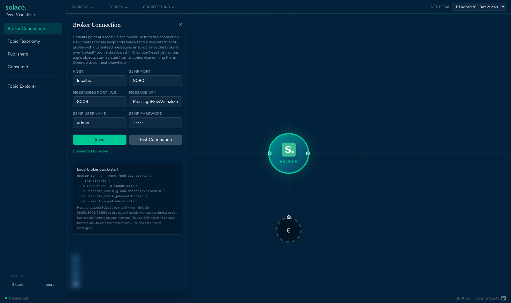
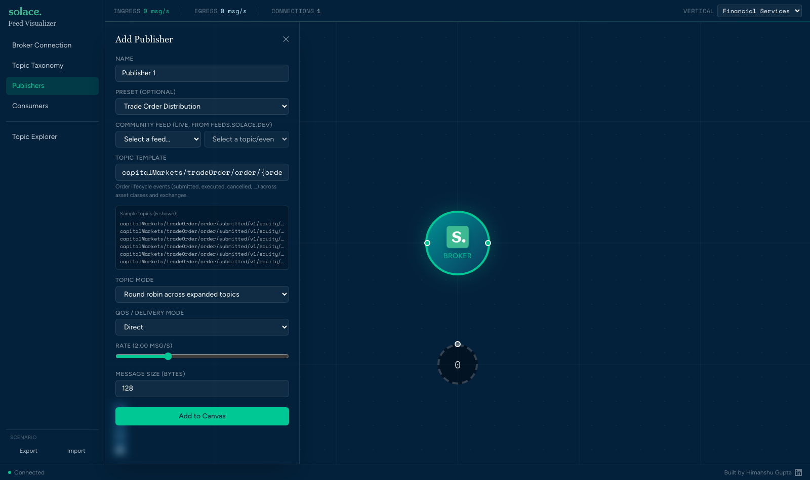
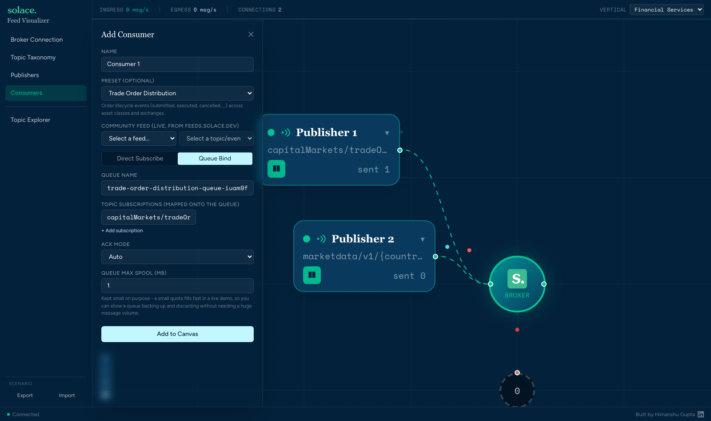
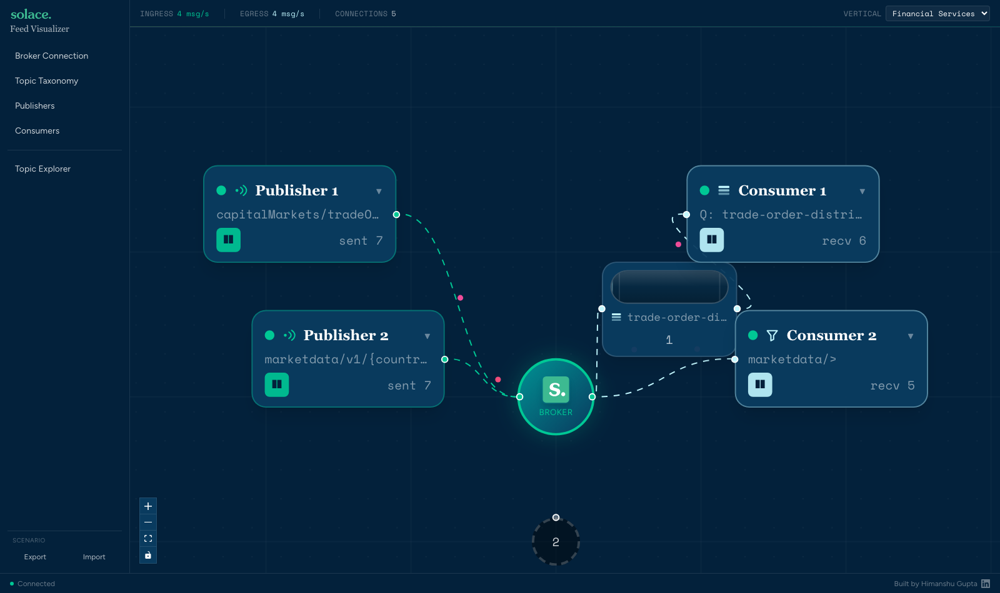
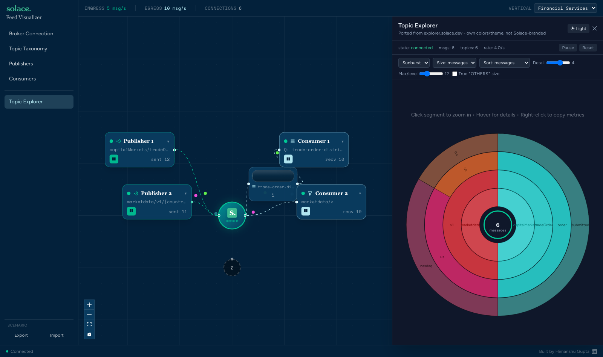

# Solace Feed Visualizer

A workshop tool that visualizes live Solace PubSub+ message flow in the browser: connect it to a
real broker, add publishers and consumers, and watch messages actually travel from publisher →
broker → consumer (or → queue → consumer) on a live canvas - built to teach topic taxonomy,
wildcard subscriptions, and guaranteed-messaging behavior to an audience in real time, not just
describe them.

## Prerequisites

- A running Solace PubSub+ broker the app can reach over SEMP (REST config/monitoring API) and
  WebSocket messaging. Don't have one? See [Local broker quick-start](#local-broker-quick-start)
  below.
- Either **Docker**, or **Node.js 20+** and [pnpm](https://pnpm.io/) for running from source.

## Running the app

### Option A: Docker (recommended for just trying it out)

```bash
docker build -t feed-viz-app .
docker run -d --name feed-viz-app -p 4001:4001 feed-viz-app
```

Open **http://localhost:4001**. The image packages the built web UI and the API/SEMP-proxy server
together behind one port - there's nothing else to run. This does **not** include the Solace
broker itself (see below) - point the app at any broker you can reach from wherever the container
runs.

To use a different host port: `-p 8090:4001` (then open `http://localhost:8090`). To point the
containerized app's proxy at a broker on your host machine rather than one reachable directly over
the network, use `http://host.docker.internal:<port>` as the broker host inside the app's Broker
Connection panel (Mac/Windows Docker Desktop; on Linux add `--add-host=host.docker.internal:host-gateway`
to the `docker run` command above).

### Option B: From source (for development)

```bash
pnpm install
pnpm dev
```

This starts two processes: the Vite dev server for the web UI on **http://localhost:4300**, and
the API/SEMP-proxy server on **http://localhost:4001** (the web dev server proxies `/api/*` to it).
Neither is a well-known default port (Vite's own default is 5173, Express's is commonly 3000) -
chosen specifically so this doesn't collide with something else already running on a workshop
laptop.

`pnpm build` builds all three workspace packages (`shared` → `server` → `web`) for production;
`pnpm --filter @feed-viz/server start` runs the built server standalone (it also serves the built
web UI as static files if `packages/web/dist` has been copied to `packages/server/public` - this
is exactly what the Docker image does; not needed for local dev).

### Local broker quick-start

No broker handy? The app's own Broker Connection panel includes this, or run it directly:

```bash
docker run -d --name feed-viz-broker \
  --shm-size=1g \
  -p 18080:8080 -p 18008:8008 \
  -e username_admin_globalaccesslevel=admin \
  -e username_admin_password=admin \
  solace/solace-pubsub-standard
```

Host ports `18080`/`18008` avoid Solace's own well-known defaults (`8080`/`8008`/`55555`) so this
doesn't collide with another broker or dev tool already on your machine. The app only talks to the
broker over SEMP and WebSocket messaging - the raw SMF port isn't needed. In the app's Broker
Connection panel, use SEMP port `18080` and messaging port `18008` to match.

## Using the app

### 1. Connect to a broker

Open **Broker Connection** (open by default) and fill in host/ports/credentials, or accept the
defaults if you're using the quick-start broker above. Testing the connection also provisions a
dedicated Message VPN and client-profile for the app (with guaranteed messaging enabled) if they
don't exist yet, so its objects stay isolated from anything else on that broker.



### 2. Add a Publisher

Open **Publishers**. Pick a built-in **Preset** (grouped by industry domain, e.g. Capital
Markets → Trade Order Distribution) to fill in a realistic topic template and its taxonomy
variables, or type your own `capitalMarkets/tradeOrder/order/{orderEventType}/.../{orderId}`-style
template using `{variable}` placeholders defined in Topic Taxonomy. There's also a **Community
Feed** picker sourced live from [feeds.solace.dev](https://feeds.solace.dev/)'s public catalog -
pick any of its real-world event feeds (retail, aviation, banking, and more) the same way. The
panel shows a live preview of the concrete topics your template expands to before you commit.



Set the publish rate, QoS (Direct or Persistent/guaranteed), and message size, then **Add to
Canvas** - a real publisher connects to the broker immediately and starts sending.

### 3. Add a Consumer

Open **Consumers**. Choose **Direct Subscribe** (a plain topic subscription) or **Queue Bind** (a
durable queue with its own topic-to-queue mappings, ack mode, and spool size) - presets and
Community Feeds work here too, pre-filling a wildcard subscription that matches everything a given
use case would publish. As you type a custom topic, a live autocomplete suggests real topics drawn
from your current publishers and the built-in taxonomy, including a one-click wildcard for
"everything under this prefix."



### 4. Watch it flow

Back on the canvas, publishers and consumers appear as real nodes around the broker, connected by
animated edges - colored particles travel the actual path each message takes (through a queue node
when one's involved), a permanent **Discarded** sink shows messages nobody's subscribed to, and
each node's sent/received counters update live from the broker's own stats, not a client-side
guess. Drag nodes around, pause/resume any publisher, or edit a node's topic/QoS/ack-mode live
without reconnecting.



### 5. Explore the topic space

Open **Topic Explorer** for a live sunburst (or icicle) breakdown of every topic actually seen on
the broker, sized and colored by message count, byte volume, or topic count - click a segment to
zoom into that branch, hover for exact metrics, right-click to copy them. It's a separate
independently-themed view (ported from [explorer.solace.dev](https://explorer.solace.dev/)) that
subscribes to `>` (everything) under the hood, so closing it before running a real "nothing
matches" discard demo matters - see the in-app tooltip on the Discarded node.



### 6. Topic Taxonomy, Verticals, and Scenarios

**Topic Taxonomy** lets you inspect and edit every variable (and its dependency chains, e.g.
exchange narrowing by country) behind the built-in presets, organized by domain tabs under the
**Vertical** selector (top right) - currently Financial Services, with Community Feeds available
everywhere as a separate, always-on source regardless of which vertical is selected. **Export /
Import** at the bottom of the left nav saves and restores an entire canvas scenario (nodes, topics,
taxonomy) as a file, for repeatable demos.

## Project structure

A pnpm workspace with three packages: `packages/shared` (types shared between web and server),
`packages/server` (a small stateless Express proxy for SEMP calls the browser can't make directly -
mainly to attach Basic Auth credentials server-side), and `packages/web` (the React + `@xyflow/react`
canvas app itself, talking to the broker directly over WebSocket via `solclientjs` for actual
pub/sub, and to `packages/server` only for SEMP monitoring/config calls).
